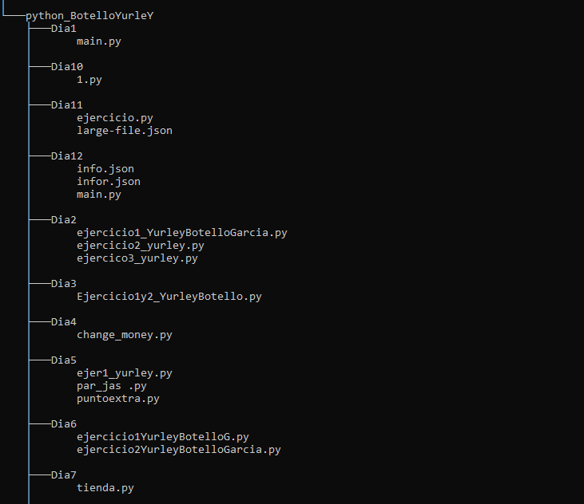
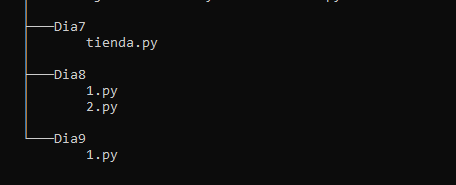

# PYTHON
 
Cuenta con varios proyectos realizados en python.

## Tabla De Contenido
| Índice | Título |
|--|------|
| 1 | DIA1 | 
| 2 | Dia2 |
| 3 | Dia3 |
| 4 | Dia4 |
| 5 | Dia5 |
| 6 | Dia6 |
| 7 | Dia7 |
| 8 | Dia8 |
| 9 | Dia9 |
| 10 | Dia10 |
| 11 | Dia11 |
| 12 | Dia12 |

## Instalación
 Deberas ejecutar el siguiente comando para clonar el repositorio y ver cada uno de los proyectos  desde tu maquina local:
 
Gith Bash

~~~ 
git clone  "link del repositorio" https://github.com/YurleyBG/carpetatrabajos_YurleyBotelloGarcia.git
~~~
al hacer esto se descargará  los datos del repositorio. puedes usar visual studio code para correr cada uno de los códigos en la terminal.
Recuerda tener instalado python en tu máquina local.

 ## Tecnología utilizadas

+ Python

## Estructura 

## Crédito 
Cada uno de estos proyectos fueron realizados por Yurley Botello.
